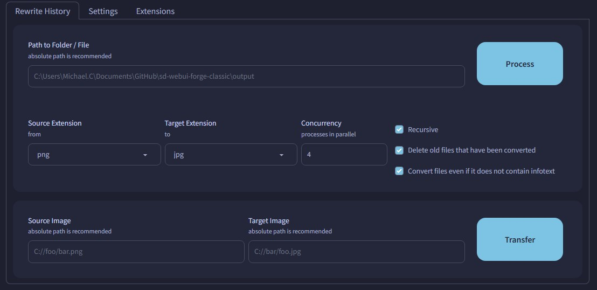

# SD Webui Rewrite History
This is an Extension for the [Automatic1111 Webui](https://github.com/AUTOMATIC1111/stable-diffusion-webui), which allows you to mass-convert image(s) to other formats, while keeping their embedded infotext. It also allows you to transfer infotext from 1 image to another.

> Compatible with [Forge](https://github.com/lllyasviel/stable-diffusion-webui-forge)

> [!NOTE]
> The saving parameters *(**eg.** quality)* are still based on the settings under **Saving images/grids**

#### But Why

When I first started using the Webui, I did not change the **File format** from `.png`, which resulted in a significant amount of storage being used. Over the past year or so, I've accumulated around 56 GB of outputs. Using this Extension to convert from `.png` to `.webp`, took around 10 min and reduced the storage usage by about half~
